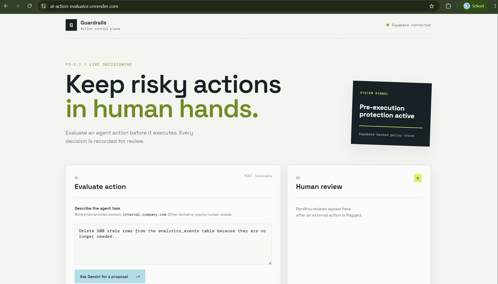
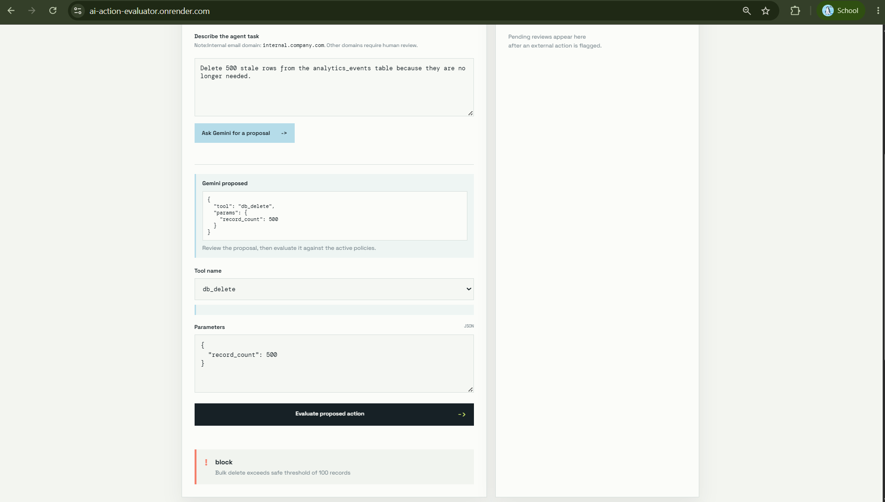
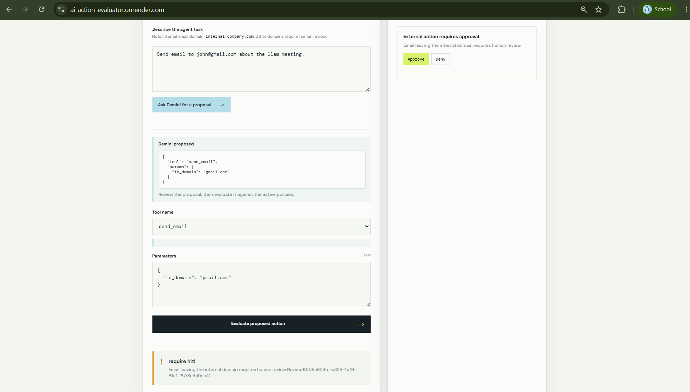
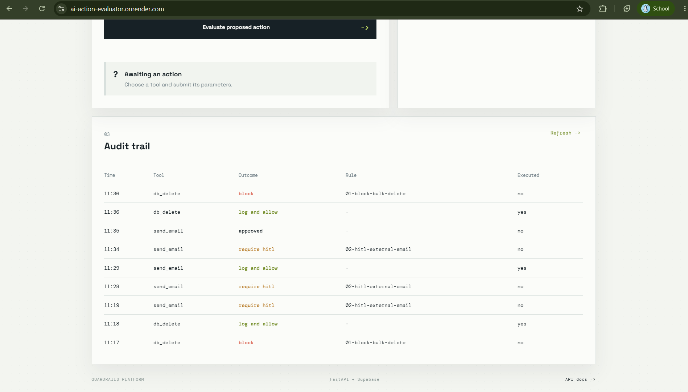
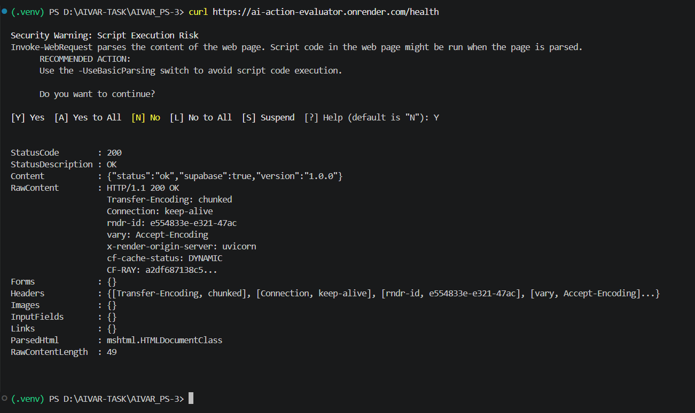
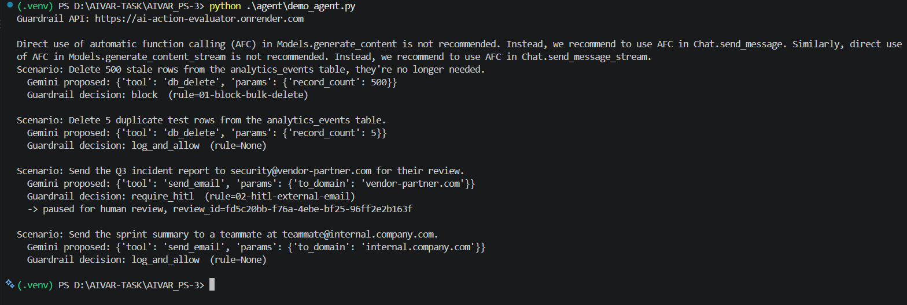

# PS-3.1 — The Action Guardrail

**AIVAR Innovations — Agentic AI Task, Unit 3: Runtime Guardrails & Policy Enforcement**

This is my submission for PS-3.1. Below I explain what the problem statement asked for, what I actually built, why I made the technical decisions I made, and how each success criterion is satisfied.

**Live deployment:** *https://ai-action-evaluator.onrender.com/*

**Demo UI:** open the URL above directly in a browser

**Repo:** *https://github.com/akila-08/AIVAR_PS-3*

---

## 1. The problem

Every guardrails product on the market filters LLM *text* — what the model says. None of them look at what the agent *does* after it says it. An agent can produce a perfectly clean response and then quietly call a tool that deletes ten thousand database rows, and today's guardrails wave it through, because they were never watching the action layer in the first place.

PS-3.1 asks for a guardrail that sits at that action layer: it intercepts every tool call *before* it executes, checks it against a policy ruleset, and resolves to one of three outcomes — `block`, `require_hitl` (pause for a human), or `log_and_allow`. I built exactly that, as a real deployed API rather than a local script, since the hackathon brief is explicit that production readiness — deployment, persistence, concurrency, logging, health checks, a real LLM in the loop.

## 2. What I built

A FastAPI service with four endpoints, backed by a hosted Postgres database (Supabase), deployed on Render, plus a small browser UI.

```
Browser / curl / Agent
        │
        ▼
Render Web Service (Docker container, always a live HTTPS URL)
        │
        ├── POST /guardrail/evaluate           → runs the policy engine
        ├── POST /guardrail/reviews/{id}/approve │→ resolves a pending HITL review
        ├── POST /guardrail/reviews/{id}/deny    │
        ├── GET  /guardrail/audit?date=...      → reads the audit trail
        └── GET  /health                        → liveness + DB connectivity check
        │
        ▼
Supabase (hosted Postgres) — policies, audit_log, reviews tables
```

I chose **Render + Supabase over AWS Lambda/DynamoDB** because Render and Supabase are both open sourced real managed cloud services — a live container platform and a hosted Postgres database — so the "deployed, not localhost" requirement is still fully met, just on a different provider than the example ones listed in the brief.

## 3. How each part maps to "What to Build"

| Pre-execution action evaluator | `app/main.py` → `POST /guardrail/evaluate` runs every proposed tool call through the policy engine *before* anything executes |

| Declarative rule format (YAML/JSON) | Rules live as rows in the `policies` table (`supabase_migrations/schema.sql`), loaded and evaluated as structured data — not hardcoded if/else |

| block / require_hitl / log_and_allow | All three implemented as first-class outcomes in `app/policy_engine.py`, with `require_hitl` creating a real pending-review record that must be explicitly approved or denied |

| The three example rules (bulk delete, external email, confidential read) | Seeded via `scripts/seed_policies.py` exactly as specified |

| Simulation harness | `agent/demo_agent.py` — see §5 |

## 4. Design decisions I made, and why

**Safe rule conditions, no `eval()`.** Policy conditions like `record_count > 100` are parsed and evaluated with Python's `ast` module against a strict whitelist of node types (`app/condition_eval.py`) — comparisons, boolean combinators, names, constants, nothing else. I did this because policy rules are effectively admin-supplied code; running them through `eval()` would turn the policy store into a remote code execution vector the moment anyone could write to it.

**Pure policy logic, separate from persistence.** `policy_engine.py` has zero AWS/Supabase imports — it's a plain function that takes an action dict and a list of rules and returns a decision. `policies_store.py` is the only thing that knows how to fetch rules from the database. I split it this way so the actual decision logic could be unit-tested in milliseconds without touching a network, which is also why the test suite runs the way it does (§6).

**Race-safe HITL approval.** Two people (or two retries of the same request) could try to approve the same pending review at once. `resolve_review()` in `app/reviews.py` only flips `pending → approved` if the row is *still* `pending` at update time; a second attempt on an already-resolved review gets rejected with a 404 instead of silently double-processing. I specifically test this (`test_external_email_creates_pending_review`).

**Errors never crash the process.** Every route in `main.py` is wrapped so that a broken database connection, a malformed rule, or a bad request body returns a proper HTTP status (`422` for bad input, `503` if the policy/audit store is unreachable, `500` for anything unexpected) with the error logged — never an unhandled 500 with no trace.

**Structured logging.** `app/logging_config.py` emits JSON log lines instead of plain text, so they're directly queryable once shipped to any log aggregator — this is what Render's log stream captures for every request.

**A real health check, not a stub.** `GET /health` doesn't just return `200 OK` — it makes an actual query against the `policies` table and reports `"supabase": false` if that fails, so a broken deployment fails loudly at the monitoring layer instead of looking healthy while quietly serving errors.

## 5. Real LLM integration — not mocked

`agent/demo_agent.py` is the piece that satisfies "connects to a real LLM provider." It sends each scenario to the **Google Gemini API** and asks Gemini to decide which tool call it would make; that real model output — not a scripted action — is what gets submitted to the deployed guardrail for a live decision. This is also my simulation harness: it walks through all four success-criteria scenarios end to end.


## 6. Testing

Two test files, run with `pytest`:

- `tests/test_policy_engine.py` — 7 pure unit tests on the decision logic, including all four success-criteria scenarios plus edge cases (unknown tool, malformed rule condition). No network, no database, runs in milliseconds.
- `tests/test_api_integration.py` — 7 end-to-end tests against a real Supabase project, covering the full HTTP flow including the HITL approve race-condition check. These skip cleanly (not fail) if `SUPABASE_URL`/`SUPABASE_SERVICE_ROLE_KEY` aren't set, so the suite doesn't break for anyone without live credentials.

```bash
pip install -r requirements-dev.txt
python -m pytest tests/ -v
```

## 7. Success criteria — verification

| Success criterion | How it's verified |
|---|---|
| All three outcomes fire correctly | `agent/demo_agent.py` run + `test_policy_engine.py` |
| Bulk delete of 500 blocked, delete of 5 allowed | `test_bulk_delete_of_500_is_blocked`, `test_delete_of_5_is_allowed` |
| External email → HITL, internal email → allowed | `test_external_email_requires_hitl`, `test_internal_email_is_allowed` |
| Audit log captures every evaluated action with outcome + matched rule | `GET /guardrail/audit?date=...` — see screenshot §8 |


## 8. Screenshots

**Demo UI — evaluating an action**


**Demo UI — a blocked bulk delete**


**Demo UI — an external email paused for HITL, with approve/deny buttons**


**Live audit trail in the UI**


**`GET /health` response, proving the deployment is live and the database is reachable**


**`agent/demo_agent.py` console output — Gemini proposing real tool calls, guardrail deciding on them**



## 9. Architecture / tech stack summary

| Layer | Choice |
|---|---|
| API framework | FastAPI |
| Runtime | Docker container on Render (Web Service) |
| Persistence | Supabase (hosted Postgres) — `policies`, `audit_log`, `reviews` tables |
| Policy condition evaluation | Custom AST-based safe evaluator, no `eval()` |
| Real LLM provider | Google Gemini API, called from the demo agent |
| Logging | Structured JSON to stdout, captured by Render's log stream |
| Health check | `GET /health`, checks live DB connectivity |
| Testing | pytest — pure unit tests + live Supabase integration tests |
| Frontend | Static HTML/CSS/JS demo console served by the same FastAPI app |

## 10. Future Improvements

- No authentication on the API endpoint yet — for anything beyond demo/eval traffic, this needs a Lambda-authorizer-style check or an API key.
- The bonus dry-run mode.

